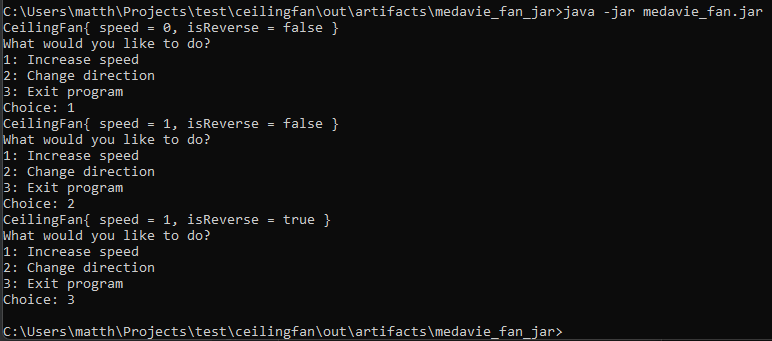

# Ceiling Fan

## Info
- Language: Java (JDK-11 - Amazon Corretto version 11.0.13)

Currently, the program can:
- Run on the command-line
- Ask a user to change the speed or direction of a Ceiling Fan
- Keep asking the user for inputs for speed or direction until they exit the program

## Setup
- Clone https://github.com/MHSnodgrass/ceilingfan.git
- CD into `ceilingfan\out\artifacts\`

## How to use
- Run using `java -jar medavie_fan.jar`
- Enter either:
    - 1 - Change the speed
    - 2 - Change the direction
    - 3 - Exit the program

## Example

